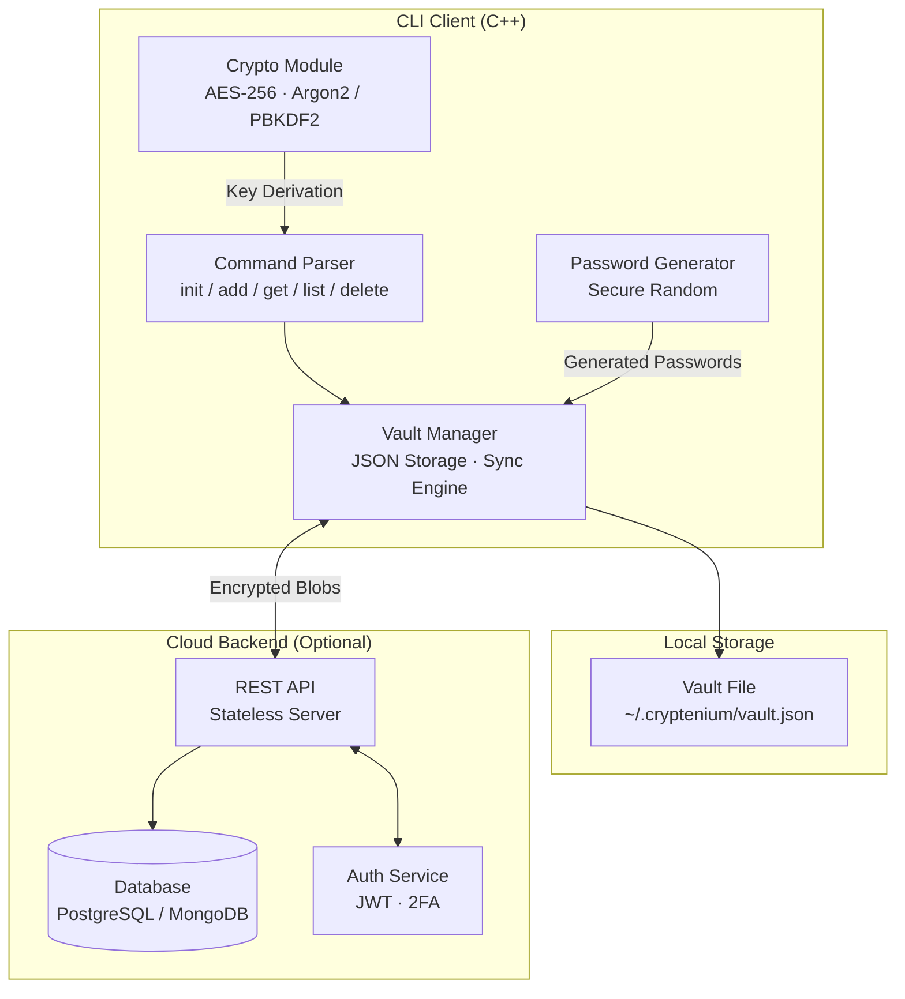

# Cryptenium

A secure, cloud-ready CLI password manager built in C++. Cryptenium keeps your credentials encrypted locally with optional cloud sync support, designed with zero-knowledge security from the ground up.

## Architecture



> *The diagram above is interactive — you can pan, zoom, and click nodes on GitHub.*

## Features

- **Master Password Protection** — vault secured by Argon2/PBKDF2 derived keys, never stored in plaintext
- **AES-256 Encryption** — all credentials encrypted before storage; zero-knowledge by design
- **Password Generation** — built-in secure random password generator with customizable length and character sets
- **Clipboard Integration** — passwords copied to clipboard on retrieval, automatically cleared after a configurable duration
- **JSON Storage** — lightweight, portable vault file at `~/.cryptenium/vault.json`
- **Cloud-Ready Architecture** — modular storage layer built for PostgreSQL, MongoDB, and REST API sync

## Commands

| Command | Description |
|---------|-------------|
| `cryptenium init` | Initialize a new password vault |
| `cryptenium add --service <name> --username <user> --password <pw>` | Store a new credential |
| `cryptenium get --service <name>` | Retrieve credentials for a service |
| `cryptenium update --service <name> --new-password <pw>` | Update password for an entry |
| `cryptenium delete --service <name> --username <user>` | Remove a credential entry |
| `cryptenium list` | List all stored entries |
| `cryptenium generate --length <n> [--symbols]` | Generate a secure random password |

## Quick Start

```bash
# Initialize your vault
cryptenium init

# Add a credential
cryptenium add --service github --username alice --password secret123

# List all entries
cryptenium list

# Retrieve a credential
cryptenium get --service github

# Generate a password
cryptenium generate --length 20 --symbols
```

## Build

### Prerequisites
- C++17 compatible compiler (g++, clang, MSVC)
- CMake (optional)

### Compile from source

```bash
g++ -std=c++17 -I include src/main.cpp src/cli.cpp src/vault.cpp src/password_generator.cpp -o cryptenium
```

Or use CMake:

```bash
mkdir build && cd build
cmake ..
cmake --build .
```

## Project Structure

```
cryptenium/
├── include/
│   ├── cli.hpp                  # CLI command parsing
│   ├── vault.hpp                # Vault storage interface
│   └── password_generator.hpp   # Password generation
├── src/
│   ├── main.cpp                 # Entry point
│   ├── cli.cpp                  # Command implementations
│   ├── vault.cpp                # JSON vault read/write
│   └── password_generator.cpp   # Secure password generation
├── CMakeLists.txt               # CMake build config
└── README.md
```

## License

Distributed under the MIT License. See `LICENSE` for more information.